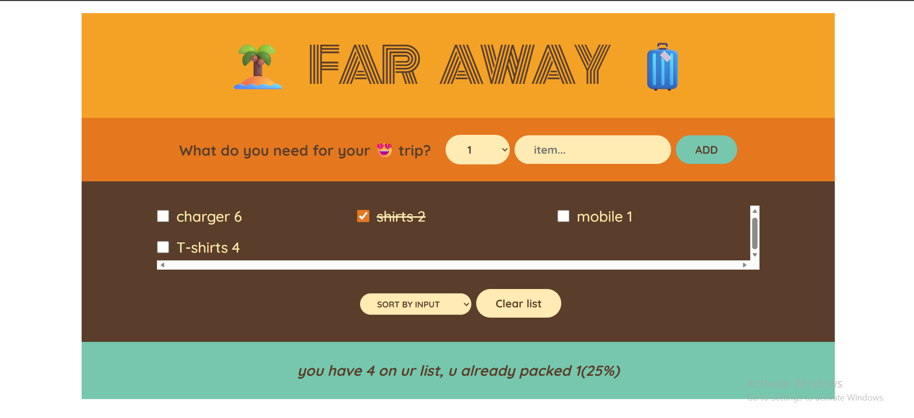

# ✈️ Travel List App

A simple and interactive **Travel Packing List** web application built with **React** that helps users organize their travel items.  
Users can add items with quantity, mark items as packed, sort the list, and track their packing progress.

---

## 🚀 Features

- Add travel items with:
  - Item description
  - Quantity
- Mark items as **packed** or **not packed**
- Remove or clear items from the list
- Sort items based on input
- Display packing statistics (total items & packed percentage)
- Clean and responsive UI

---

## 🛠️ Built With

- React (Functional Components & Hooks)
- JavaScript (ES6+)
- CSS / Tailwind (if used)
- Vite (if used for setup)

---

## 📸 Screenshots

Add your screenshots here.

Example:

```md

```
"# Travel-list" 
